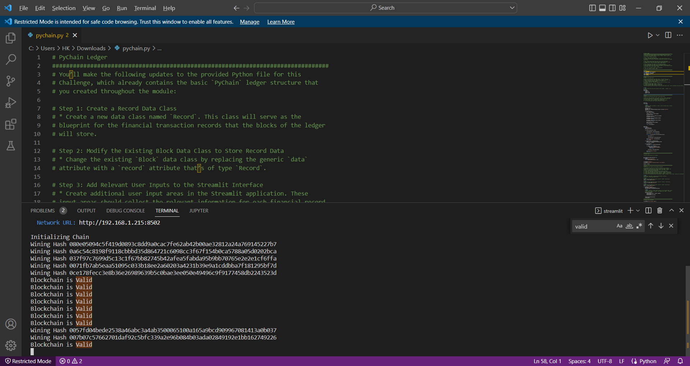
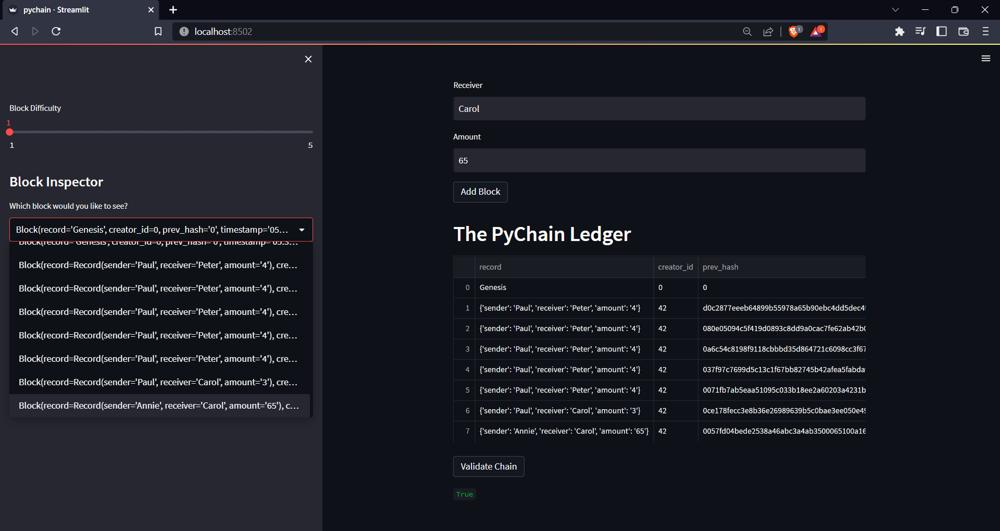
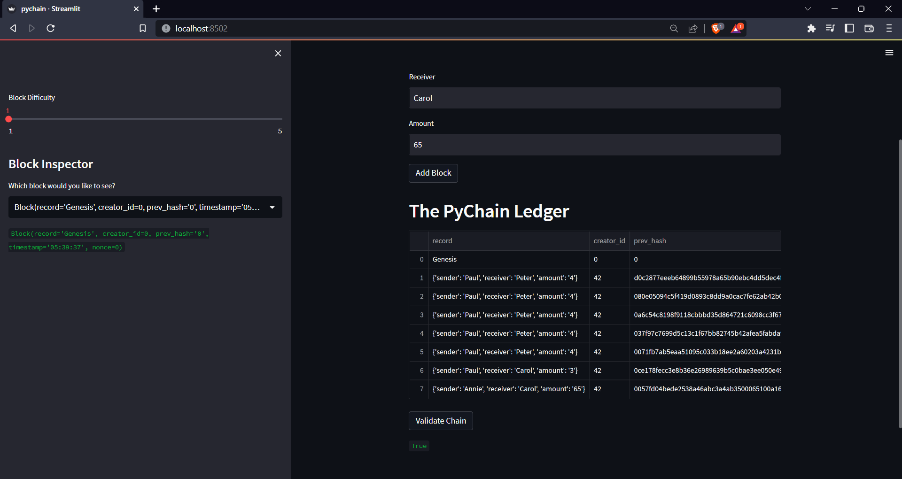

This repository contains a file named "pychain.py"
It contains screenshots of pychain.py executed on an open source app framework called Streamlit.
Pychain.py when executed runs a basic blockchain ledger that keeps a Record from a Sender to a Receiver. The blocks and unique hashes are stored and can be reviewed and verified with the Block Inspector function.

